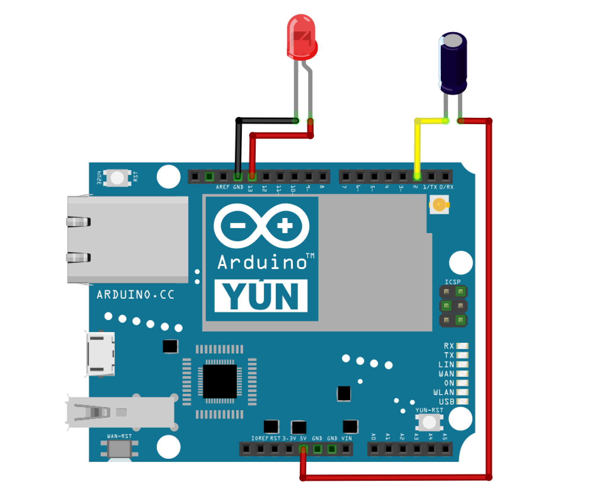
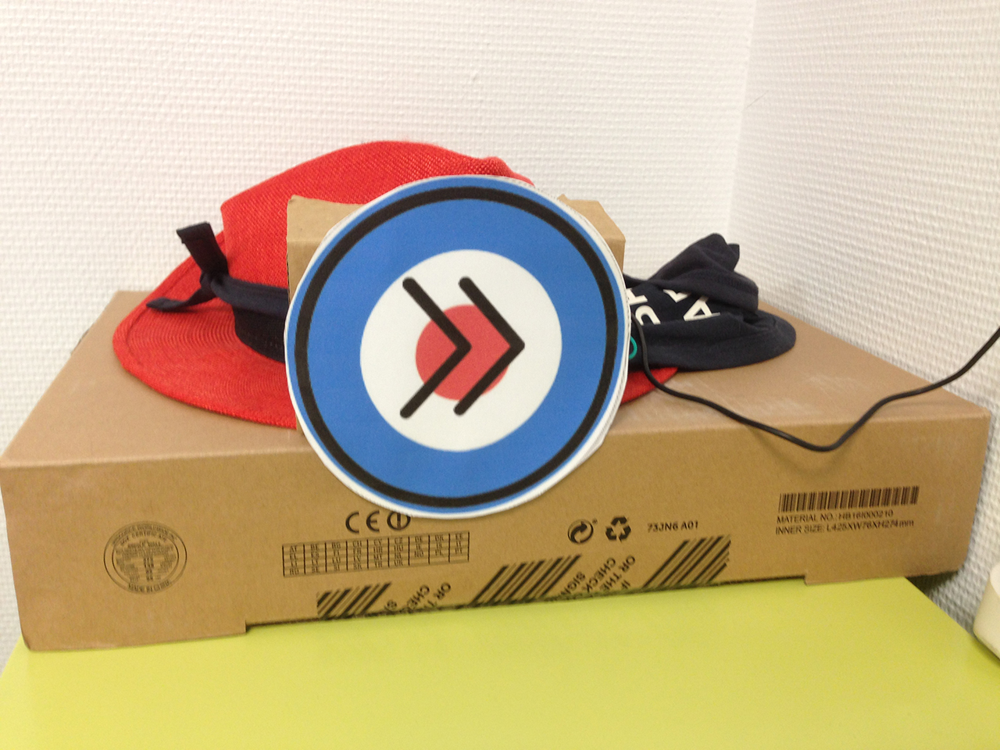
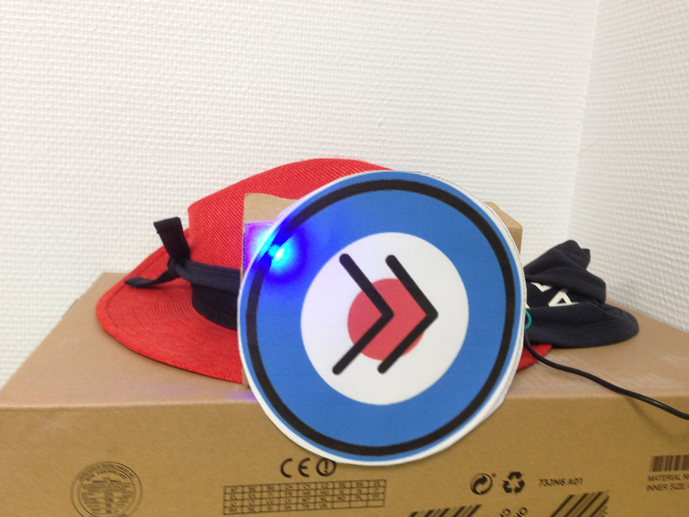
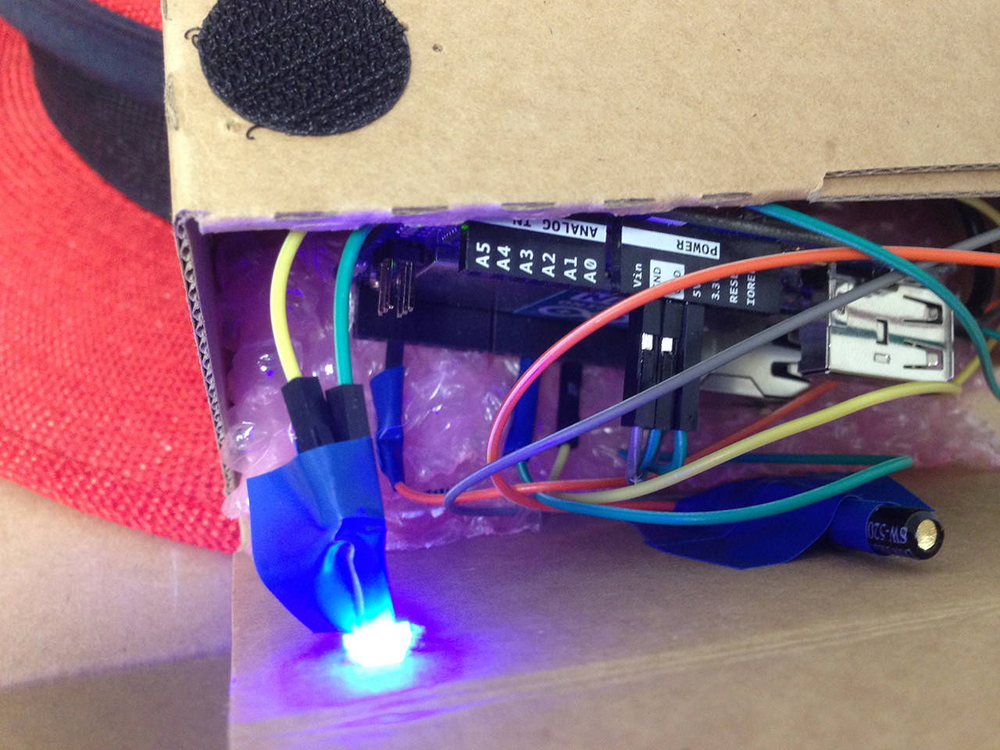

# SoundTouch 🔊 Nerf 🔫 Target 🎯

## Description

Create your own nerf target, if you don't like the music played on the Soundtouch !
Just hit the target 🎯 and the code will send a next music event ⏭️ !

If you are bad with 🎯🔫 Nerf:
you can use the great [Soundtouch Chrome Extension](https://chrome.google.com/webstore/detail/soundtouch-chrome-extensi/gapfkijlllenhmgddoldcfedfiiakfgg) 👍😬

## Configuration

Edit the SoundTouch IP :

```cpp

//edit with your soundtouch ip 
const String soundtouchIP = "10.0.10.166";

```

## Schematics

 

## Preview

  

## Stuff

Simple stuff

#### Yun
...

#### Fast Vibration Sensor Switch
 

#### Led
...

## TODO

- [ ] Edit next time lock
- [ ] Clean code
- [ ] Log shoot 
- [ ] News features ?
